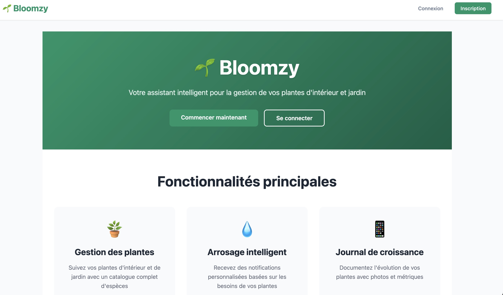

# Bloomzy

Bloomzy est une plateforme collaborative pour la gestion intelligente des plantes d’intérieur et du potager, intégrant des fonctionnalités communautaires, des notifications, et de l’IA.

## Structure du projet

- **backend/** : API Python (Flask), gestion Auth, base de données, tests
- **frontend/** : Application Vue.js, interface utilisateur, tests
- **docs/** : Documentation technique, fonctionnelle et API


## Aperçu de l'application



## Démarrage rapide

### Backend
```zsh
cd backend
python3 -m venv .venv
source .venv/bin/activate
pip install -r requirements.txt
pytest tests/
```

### Frontend
```zsh
cd frontend
npm install
npm run dev
```

## Documentation
Consultez le fichier [docs/index.md](docs/index.md) pour la liste complète des documentations (API, PRDs, contraintes techniques, TODOs).

## Méthodologie
- TDD obligatoire (tests avant code)
- Documentation à jour
- Git Flow strict (branche par fonctionnalité, PR, merge sur main après validation)

## Liens utiles
- [Roadmap GitHub](https://github.com/MrRaph/Bloomzy/projects/3)
- [Issues](https://github.com/MrRaph/Bloomzy/issues)

---
Pour toute contribution, merci de respecter les instructions du projet et de consulter les fichiers de référence dans le dossier `docs/`.
